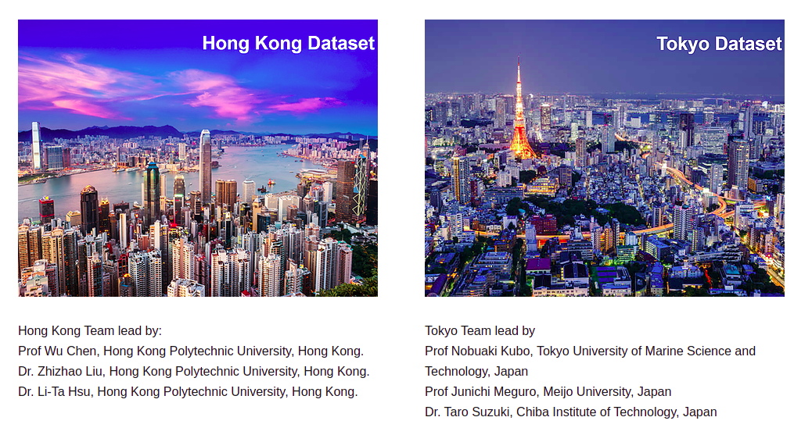
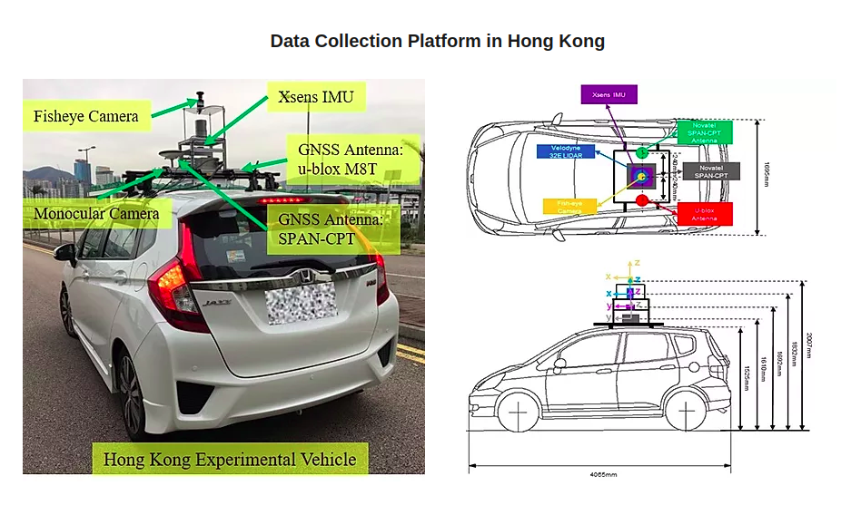
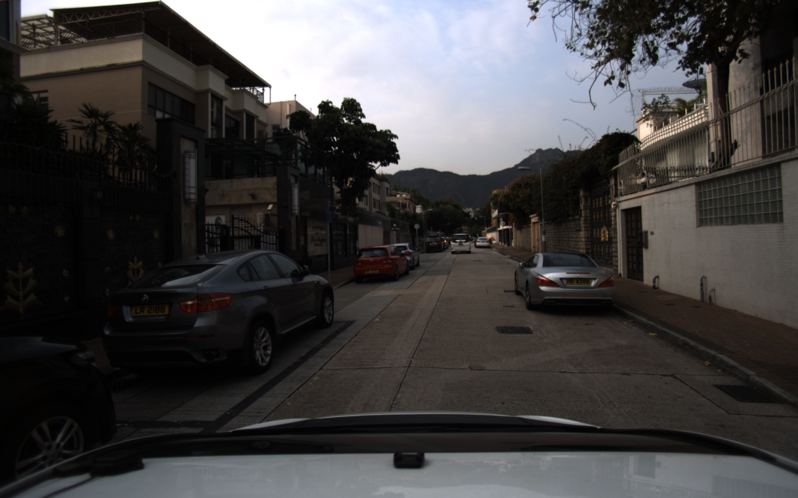
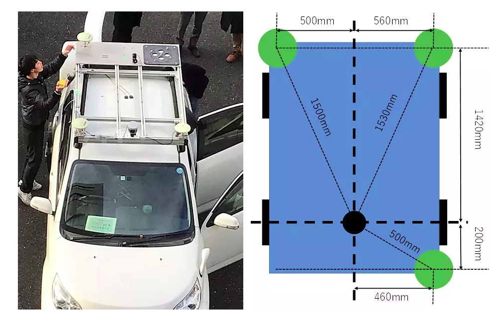
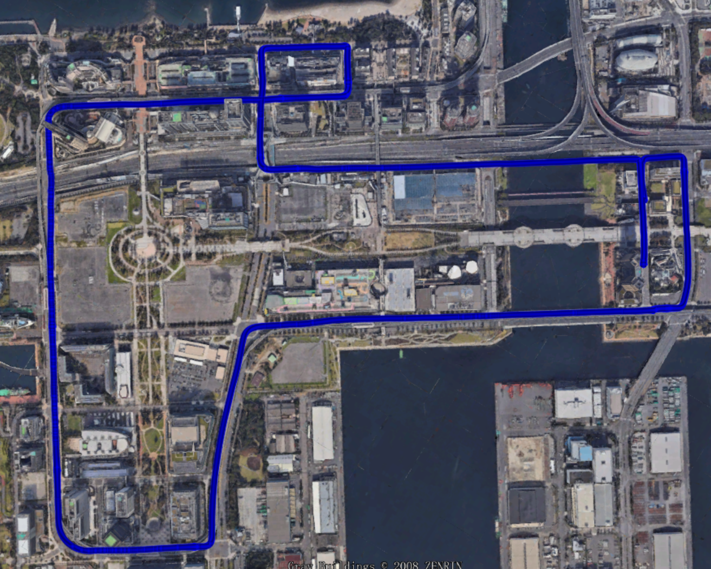
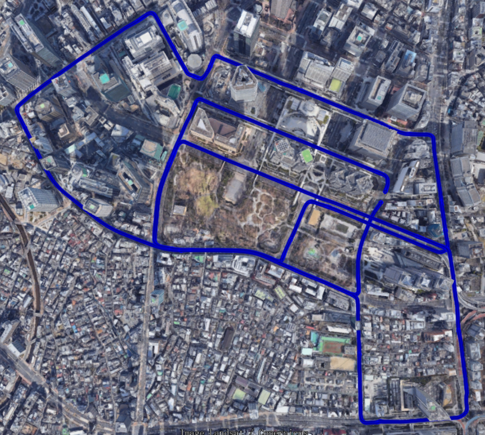

# UrbanNav
### An Open-Sourcing Localization Dataset Collected in Asian Urban Canyons, including Tokyo and Hong Kong

This repository is the usage page of the [UrbanNav dataset](https://www.polyu-ipn-lab.com/download). Positioning and localization in deep urban canyons using low-cost sensors is still a challenging problem. The accuracy of GNSS can be severely challenged in urban canyons due to the high-rising buildings, leading to numerous Non-line-of-sight (NLOS) receptions and multipath effects. Moreover, the excessive dynamic objects can also distort the performance of LiDAR, and camera. The UrbanNav dataset wishes to provide a challenging data source to the community to further accelerate the study of accurate and robust positioning in challenging urban canyons. The dataset includes sensor measurements from GNSS receiver, LiDAR, camera and IMU, together with accurate ground truth from [SPAN-CPT](https://novatel.com/products/span-gnss-inertial-navigation-systems) system. Different from the existing dataset, such as [Waymo](https://waymo.com/open/), [KITTI](http://www.cvlibs.net/datasets/kitti/), UrbanNav provide raw GNSS [RINEX](https://en.wikipedia.org/wiki/RINEX) data. In this case, users can improve the performance of GNSS positioning via raw data. **In short, the UrbanNav dataset pose a special focus on improving GNSS positioning in urban canyons, but also provide sensor measurements from LiDAR, camera and IMU**. If you got any problems when using the dataset and cannot find a satisfactory solution in the issue list, please open a new issue and we will reply ASAP.

Key words: **Positioning**, **Localization**, **GNSS Positioning**, **Urban Canyons**, **GNSS Raw Data**,**Dynamic Objects**, **GNSS/INS/LiDAR/Camera**, **Ground Truth**

<p align="center">
  
</p>

**Important Notes**: 
  - **About access to GNSS RINEX file**: The GNSS measurements is provided as GNSS [RINEX](https://en.wikipedia.org/wiki/RINEX) data. We will recently open-source a package, the [GraphGNSSLib](https://github.com/weisongwen/GraphGNSSLib), which provide easy access to the GNSS RINEX file and publish the data as customized ROS message. Meanwhile, we [GraphGNSSLib](https://github.com/weisongwen/GraphGNSSLib) also provide the capabilities of GNSS positioning and real-time kinematic (RTK) using factor graph optimization (FGO). If you wish to use the GraphGNSSLib, keep an eye on the update of this repo.
  - **Dataset contribution**: Researches who wish to contribute their dataset as part of the UrbanNav dataset, please feel free to contact me via email <17902061r@connect.polyu.hk>. We wish the UrbanNav can be a platform for navigation solution development, validation and sharing.
  - **Algorithm validation and contribution**: Researches are welcomed to share their navigation solution results, source code to the UrbanNav dataset after a code review process, e,g, code for GNSS/INS integration or LiDAR SLAM, etc. 

## Objective of the Dataset:

- Benchmarking different positioning algorithms using the open-sourced dataset.

- Raising the awareness of the urgent navigation requirement in highly-urbanized areas especially in Asian-Pacific regions.

**Contact Authors (corresponding to issues and maintenance of the currently available dataset)**: [Weisong Wen](https://weisongwen.wixsite.com/weisongwen), [Feng Huang](https://www.polyu-ipn-lab.com/),[Li-ta Hsu](https://www.polyu-ipn-lab.com/) from the [Intelligent Positioning and Navigation Laboratory](https://www.polyu-ipn-lab.com/), The Hong Kong Polytechnique University

**Related Papers (Submitted):** (paper is not exactly same with code)
  - Wen Weisong., Hsu, Li-Ta.* (2020) **GraphGNSSLib: An Open-source Package for GNSS Positioning and Real-time Kinematic Using Factor Graph Optimization**, GPS Solutions. (**Submitted**)

*if you use GraphGNSSLib for your academic research, please cite our related [papers](https://www.polyu-ipn-lab.com/)*


## 1. Hong Kong Dataset
### 1.1 **Sensor Setups**
The platform for data collection in Hong Kong is a Honda Fit. The platform is equipped with the following sensors:
  - 3D LiDAR snesor ([HDL 32E Velodyne](https://velodynelidar.com/products/hdl-32e/)): (360 HFOV, +10~-30 VFOV, 80m range, 10Hz) 
  - IMU ([Xsens Mti 10](https://www.xsens.com/products/mti-10-series), 100 Hz, AHRS)
  - GNSS receiver: u-blox M8T or u-blox F9P (**to be updated**)  
  - camera:(1920X1200,79.4°X96.8°, 10Hz) 
  - [SPAN-CPT](https://www.novatel.com/products/span-gnss-inertial-systems/span-combined-systems/span-cpt/):(RTK GNSS/INS,RMSE: 5cm, 1Hz) 

<p align="center">
  
</p>

### 1.2. Dataset 1: UrbanNav-HK-Data20190428
**Brief**: Dataset UrbanNav-HK-Data20190428 is collected in a typical urban canyon of Hong Kong near TST which involves high-rising buildings, numerous dynamic objects. The coordinates transformation between multiple sensors, and intrinsic measurements of camera can be found via [Extrinsic Parameters](UrbanNav-HK-Data20190428/extrinsic.yaml), [IMU Nosie](UrbanNav-HK-Data20190428/xsens_imu_param.yaml) and [Intrinsic Parameters of Camera](UrbanNav-HK-Data20190428/camera_extrinsic.yaml).

Some key features are as follows:
  | Date of Collection | Total Size |Path length |Sensors |
  | :---:  | :---:  |:---:  |:---:  |
  | 2019/04/28 | 42.9 GB|2.01 Km |GNSS/LiDAR/Camera/IMU/SPAN-CPT |

- Download by Dropbox Link: [Data INFO](https://www.dropbox.com/s/u8jise47l01g19v/Data%20Info%20Dropbox.zip?dl=0)
  - [UrbanNav-HK-Data20190428](https://www.dropbox.com/s/pfjvauvletdpnh2/2019-04-28-20-58-02.bag?dl=0) (ROS)
    - ROSBAG file which includes:
      - GNSS positioning (solution directly from GNSS receiver): ```/ublox_node/fix```
      - 3D LiDAR point clouds: ```/velodyne_points```
      - Camera: ```/camera/image_color```
      - IMU: ```/imu/data```
      - SPAN-CPT: ```/novatel_data/inspvax```
  - [GNSS](https://www.dropbox.com/s/25dsnx27wu8zgew/GNSS%20RINEX%20UrbanNav-HK-Data20190428.tar.gz?dl=0) (RINEX)
    - GNSS RINEX files, to use it, we suggest to use the [RTKLIB](http://www.rtklib.com/)
  - [IMU/SPAN-CPT](https://www.dropbox.com/s/g1xt89py1j0uea1/IMU-Reference%20UrbanNav-HK-Data20190428.zip?dl=0) (CSV)
    - IMU and SPAN-CPT data for **non-ROS users**.

For mainland china users, please download the dataset using the **Baidu Clouds Links**
- Download by Baidu Cloud Link: [Data INFO](https://pan.baidu.com/s/1QeeJMZutOtZBK0wXnVKM3Q), (qm3l)
  - [UrbanNav-HK-Data20190428](https://pan.baidu.com/s/1ieaSk9MPBgSvfuJhHTbDjQ) (ROS)  (nff4)
    - ROSBAG file whihc includes:
        - GNSS positioning (solution directly from GNSS receiver): ```/ublox_node/fix```
        - 3D LiDAR point clouds: ```/velodyne_points```
        - Camera: ```/camera/image_color```
        - IMU: ```/imu/data```
        - SPAN-CPT: ```/novatel_data/inspvax```
  - [GNSS (RINEX)](https://pan.baidu.com/s/1VEhmaf56R4cKeoUpZBrOug) (gojb)
    - GNSS RINEX files, to use it, we suggest to use the [RTKLIB](http://www.rtklib.com/)
  - [IMU/SPAN-CPT](https://pan.baidu.com/s/12gMv9EXt5Rpqu_14xcIaVw) (CSV) (k3dz)
    - IMU and SPAN-CPT data for **non-ROS users**.

<p align="center">
  
</p>

### 1.3. Dataset 2: UrbanNav-HK-Data20200314
**Brief**: Dataset UrbanNav-HK-Data2020314 is collected in a low-urbanization area in Kowloon which suitable for algorithmic verification and comparison. The coordinates transformation between multiple sensors, and intrinsic measurements of camera can be found via [Extrinsic Parameters](UrbanNav-HK-Data20200314/extrinsic.yaml), [IMU Nosie](UrbanNav-HK-Data20200314/xsens_imu_param.yaml) and [Intrinsic Parameters of Camera](UrbanNav-HK-Data20200314/camera_extrinsic.yaml).

Some key features are as follows:
  | Date of Collection | Total Size |Path length |Sensors |
  | :---:  | :---:  |:---:  |:---:  |
  | 2020/03/14 | 27.0 GB|1.21 Km |LiDAR/Camera/IMU/SPAN-CPT |

- Download by Dropbox Link: 
  - [UrbanNav-HK-Data20200314](https://www.dropbox.com/s/3mtlncglrv7p39l/2020-03-14-16-45-35.bag.tar.gz?dl=0) (ROS)
    - ROSBAG file which includes:
      - 3D LiDAR point clouds: ```/velodyne_points```
      - Camera: ```/camera/image_color```
      - IMU: ```/imu/data```
      - SPAN-CPT: ```/novatel_data/inspvax```
  - [GNSS](https://www.dropbox.com/sh/22mnpg86umjb4zh/AAAsIiQ1WAMp20OROUn4h6pka?dl=0) (RINEX)
    - GNSS RINEX files, to use it, we suggest to use the [RTKLIB](http://www.rtklib.com/)

For mainland china users, please download the dataset using the **Baidu Clouds Links**
- Download by Baidu Cloud Link:
  - [UrbanNav-HK-Data20200314](https://pan.baidu.com/s/1MxIZFUjmDtU0luJ7fOXz2w) (ROS)  (n71w)
    - ROSBAG file whihc includes:
        - 3D LiDAR point clouds: ```/velodyne_points```
        - Camera: ```/camera/image_color```
        - IMU: ```/imu/data```
        - SPAN-CPT: ```/novatel_data/inspvax```
  - [GNSS](https://pan.baidu.com/s/1tybs95h3Iz5IjMGw5zJlkQ) (z8vw) (RINEX)
      - GNSS RINEX files, to use it, we suggest to use the [RTKLIB](http://www.rtklib.com/)

<p align="center">
  
</p>


## 2. Tokyo Dataset
### 2.1 **Sensor Setups**
The platform is equipped with the following sensors:
  - 3D LiDAR snesor ([16 channels, puck, Velodyne] 
  - IMU (50 Hz)
  - GNSS receiver (Trimble)
  - ground truth (RTK GNSS/INS,RMSE: 5cm, 10Hz) 

<p align="center">
  
</p>

### 2.2. Dataset 1: UrbanNav-TK-20181219
#### Important Notes: the LiDAR calibration file for the LiDAR sensor, extrinsic parameters between sensors are not available now. If you wish to study the GNSS/LiDAR/IMU integration, we suggest using the dataset above collected in Hong Kong. However, the GNSS dataset from Tokyo is challenging which is collected in challenging urban canyons!

  | Date of Collection | Total Size |Path length |Sensors |
  | :---:  | :---:  |:---:  |:---:  |
  | 2018/12/19 | 4.14 GB|>10 Km |GNSS/LiDAR/IMU/Ground Truth |

  - Download by [Dropbox Link](https://www.dropbox.com/s/isu1bugpgr8dpas/Tokyo_Data.zip?dl=0): 
For mainland china users, please download the dataset using the **Baidu Clouds Links**. [Baidu Clouds Links](https://pan.baidu.com/s/1SVhRnD6yigzizqSUfifw1A) (7xpo)

<p align="center">
  
</p>
<p align="center">
  
</p>


## 3. Acknowledgements
We acknowledge the help from Guohao Zhang, Yin-chiu Kan Weichang Xu and Song Yang for data collection.

## 4. License
For any technical issues, please contact [Weisong Wen](https://weisongwen.wixsite.com/weisongwen) via email <17902061r@connect.polyu.hk>. For commercial inquiries, please contact [Li-ta Hsu](https://www.polyu-ipn-lab.com/) via email <lt.hsu@polyu.edu.hk>.

## 5. Related Publication

1. Wen, Weisong, Guohao Zhang, and Li-Ta Hsu. "Exclusion of GNSS NLOS receptions caused by dynamic objects in heavy traffic urban scenarios using real-time 3D point cloud: An approach without 3D maps." Position, Location and Navigation Symposium (PLANS), 2018 IEEE/ION. IEEE, 2018. 

2. Wen, W.; Hsu, L.-T.*; Zhang, G. (2018) Performance analysis of NDT-based graph slam for autonomous vehicle in diverse typical driving scenarios of Hong Kong. Sensors 18, 3928.

3. Wen, W., Zhang, G., Hsu, Li-Ta (Presenter), Correcting GNSS NLOS by 3D LiDAR and Building Height, ION GNSS+, 2018, Miami, Florida, USA.

4. Zhang, G., Wen, W., Hsu, Li-Ta, Collaborative GNSS Positioning with the Aids of 3D City Models, ION GNSS+, 2018, Miami, Florida, USA. (Best Student Paper Award)

5. Zhang, G., Wen, W., Hsu, Li-Ta, A Novel GNSS based V2V Cooperative Localization to Exclude Multipath Effect using Consistency Checks, IEEE PLANS, 2018, Monterey, California, USA.
Copyright (c) 2018 Weisong WEN

6. Wen Weisong., Tim Pfeifer., Xiwei Bai., Hsu, L.T.* Comparison of Extended Kalman Filter and Factor Graph Optimization for GNSS/INS Integrated Navigation System, The Journal of Navigation, 2020, (SCI. 2019 IF. 3.019, Ranking 10.7%) [Submitted]
